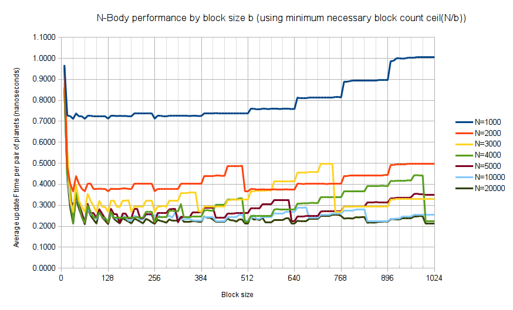

Project 1
=========

* Kai Ninomiya <kainino> (Arch Linux, Intel i5-4xxx, GTX 750)

Part 4
------

### _N_-body performance analysis

* How does changing the tile and block sizes change performance? Why?
* How does changing the number of planets change performance? Why?

This graph shows per-frame updateF simulation time (scaled by numbers of pairs
of planets for comparability). Note the following:

* Simulation time goes roughly as _N_², but is a little bit below that. Likely
  due to some constant overhead per-CUDA-thread/block (since it's creating more
  _N_ threads).
* Simulation time has local minima at certain block sizes (initially every 32
  threads per block), and spikes right after that. These correspond with
  multiples of powers of two (32, 64, 128). Probably because with, say, a block
  size of 32, all of the SPs inside of an SM are used
  (e.g. 32 * 16 = 512 <= 512), but with a block size of 33, some are left
  unused (e.g. 33 * 15 = 495 <= 512)
* For each graphed value of _N_, there's a sudden drop (performance increase)
  when the block size passes _N_/4 (and a smaller one at _N_/8). These are
  major points where the number of blocks decreases by one.

### Performance predictions: matrix_math

* Without running experiments, how would you expect the serial and GPU verions
of matrix_math to compare? Why?

For matrix addition and subtraction, I don't expect much
of a performance increase, if any, using the GPU. Since these operations are
linear-time in the size of the matrix _n_, the linear-time memory copy
still dominates.

For matrix multiplication, it reduces the runtime from _O(n^1.5)_ to _O(n)_.
For smaller matrices, it should be possible to do this within one block, and
use shared memory instead of global memory, which may improve performance.
